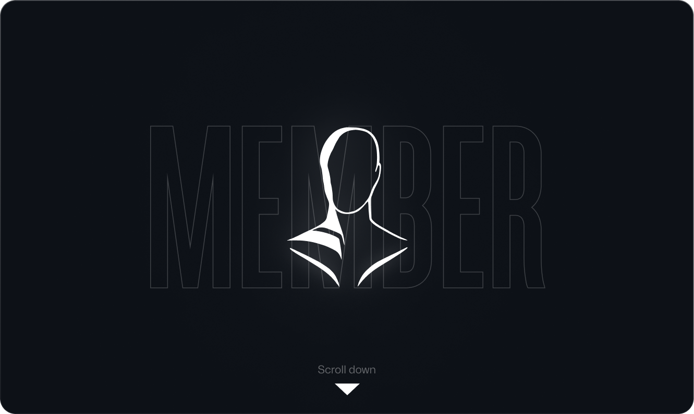

    

<h2>nicknames:</h2>
<ul>
    <li>member</li>
    <li>desmoral</li>
</ul>

<h2>skills:</h2>

  

<h2>music preferences:</h2>
<ul>
    <li>screamo</li>
    <li>indie folk</li>
    <li>post rock</li>
    <li>midwest emo</li>
</ul>

<h2>telegram channels:</h2>
<ul>
    <li><a href="https://t.me/desmoralkontora">desmoral-kontora</a></li>
    <li><a href="https://t.me/memberbio">bio</a></li>
    <li><a href="https://t.me/formulateplease">Formulate, Please</a></li>
    <li><a href="https://t.me/desmoralfiles">desmoral-files</a></li>
</ul>

</body>
</html>
